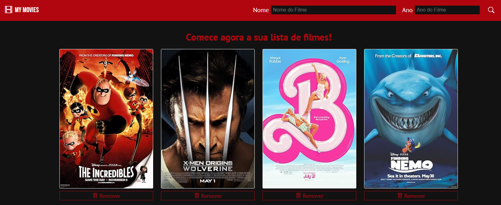

# 🎞️ My Movies - Gerenciador de playlist de filmes

## Descrição
- App responsável por gerenciar informações de filmes pesquisados pelo usuário. Por meio do app, é possível adicionar ou remover informações de filmes para gerenciar uma playlist personalizada.
## Tecnologias utilizadas
- HTML5: estruturação dos elementos do app;
- CSS3: estilização do app e responsividade;
- Javascript: consumo da API RESTful OMDb para obter informações dos filmes, manipulação do DOM para fornecer interatividade de elementos, tratamento de erros e local storage para armazenar os cards dos filmes localmente;
- Notie-Master: pacote externo feito em Javascript utilizado para fornecer notificações e feedbacks para o usuário durante o uso do app;
- Bootstrap Icons: ícones utilizados no app;
- Google Fonts: API usada para adicionar as fontes PT Sans e Bebas Neue ao app;
## Licença
Este código está licenciado usando a [licença-MIT](./LICENSE).
